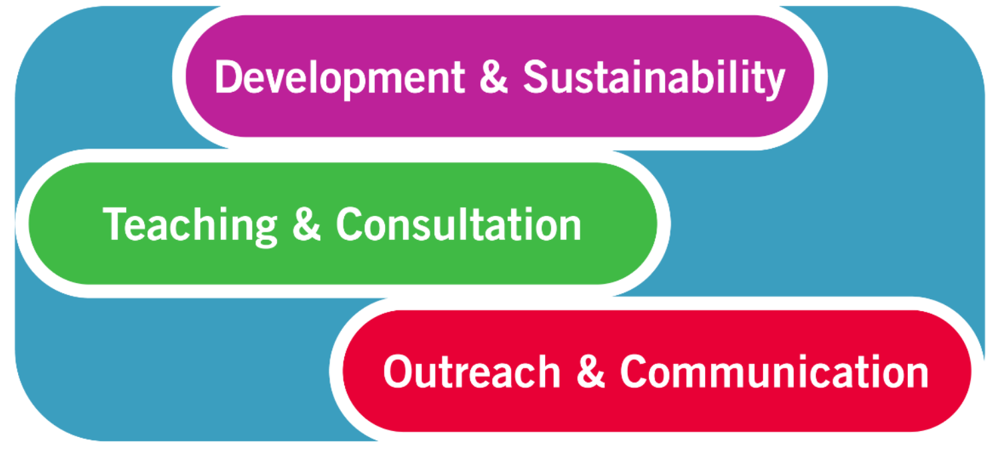
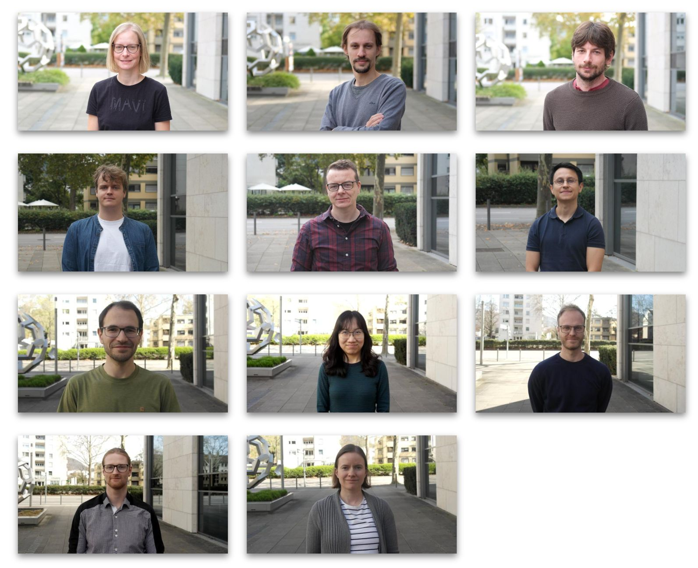

<!-- _class: title -->
<!-- _paginate: false -->
<!-- _footer: "Last updated: 2026-05-26" -->

# LLMs and Agentic AI in research

## Liam Keegan, Harald Mack (SSC)

---

## Scientific Software Center

> The Scientific Software Center strives to improve research software development practices at Heidelberg University and beyond, to promote reproducible science and research software sustainability.

---

## Scientific Software Center

We are a team of *Research Software Engineers*

---

## LLMs and Agentic AI?

⚠️LLMs and AI Agents are not the same!

### **LLM - 'Large language model'**
- process language piece by piece
- execution engine for agentic applications, similar to Python Interpreter vs App
- **stateless**: act only on current content of context window
- **not deterministic**

### **AI Agent**
- LLM + tools + specifications + memory
- LLM is the CPU, not the system
- MCP (tools): run python, search the web
- Skills (manuals and workflow)
- Role definitions ('agents' = identity)
- Various kinds of memory

⚠️Agents can modify their own context: Choose skill, tool etc. New challenges for security.

---

## Agent memory and context

### **Memory**

Stored data with which context is augmented

- **procedural memory**: workflows, skills, rules, tools, system prompt, 'learned behavior'
- **episodic memory**: 'experiences', specific events, interactions, outcomes
- **semantic memory**: facts, entity relationships, scope definitions, weights, RAG
- **working memory**: The context window
    - current interaction
    - open files

### **Context**

Not just what you write into the chat window.

- interaction history, including current prompt
- system prompt: General behavior, role definition, rules to always follow
    - Agent definitions can replace this with your own
- tool definitions, output and execution results
- chain of thought (in reasoning mode)
- Selected elements of memory
    - skill or subagent definitions
    - parts of episodic memory
    - facts or semantic memory

---

## Context engineering
- How to manipulate model context to make it effective and efficient
- What does the model see at any given point
- Automatically done by LLM/Agent vendor:
    - context summarization (automatically done): Can oversimplify
    - progressive disclosure of files, skills, tools...
    - when to write memory
    - system prompt
- Manually done by user:
    - fresh context window for new task
    - prompt engineering
    - when to clear context
    - keep context free of contradictions: skills, prompt templates, agent roles...
- Badly engineered context can degrade performance
---

## Agent Harness and harness engineering

- **Harness**: Execution environment (operationg system) of the Agent
- **Harness engineering**: Designing the execution environment around an LLM

- memory: Skills, subagents, Tools
- workflow model and task progression
- security boundaries and constraints, sandboxing
- treat failure as a bug in the system, not as a bad prompt to retry

- The harness is increasingly a determining factor for performance https://www.preprints.org/manuscript/202604.0428
- Performance should be seen as harness plus model, not one alone https://arxiv.org/html/2605.27922v1#S6
- Skills are not a universal tool to improve performance https://arxiv.org/pdf/2603.15401

<!-- ---
## Applications

- literature review
- summarization of results
- teaching and education (student and teacher)
- simple experiment loops:
    - evaluate - hypothesis - modify - evaluate - ...
- writing new skills for an agent
- drafting of text
- create illustrations
- coding -->

---
## Coding with AI Agents

- Cooperation between human and machine
    - machine: developer human: architect, product owner, manager
- You are absorbing the failure, so you are responsible
- Scientific work is (typically) not in the training data
    - but individual steps in the workflow are
- Reversal of roles:
    - Machine knows more than we do about coding
    - Human is architect, product owner, carrier of responsibility, manager
- In using coding agents, we need to use our skills in different ways
    - how to express intent effectively
    - how to keep the agent on track
    - how to keep ourselves on track
    - software architecture, verification, validation, problem structuring
---
## Our Experiences with (coding) agents
- Makes development a lot faster
- Great for debugging and tracing errors
- Great for processing a lot of 'stuff' quickly
    - find and review literature
    - summarize results from 200 ML experiments
    - find libraries, read documentation, generate 'cookbooks'
- Good for larger projects or more diverse work...
    - ... if context and harness are engineered well
- Local focus: LLMs struggle with the big picture
    - Architecture, global requirements, ingrained assumptions...
    - Agents compensate for ignorance with complexity
- Coding agents often are skill amplifiers

---
## Our Experiences with (coding) agents
- Role change: Hands-on developer to Product owner/manager/architect/senior dev
    - Reviewing and permanent vigilence can become exhausting
    - Changes the daily workflow
- Deep understanding becomes more important more quickly:
    - Planning, requirements engineering
    - tests and constraints...
- Techniques that once were not practical now become feasible and beneficial
    - Code can get better through use of coding agents
- Use of coding agents could make larger projects more feasible
    - Transfer old code to new languages
- 'Last mile problem'
    - AI agents often 'almost get there', but not quite.

---
## Spec-driven development
- Effective way to develop software with coding agents
- Agentic coding is fast, so it's easy to loose control: 'Comprehension dept'
    - side effects?
    - dependencies maintained, trustworthy?
    - is the result compliant with requirements and constraints
- Specifications of your intent are the source of truth
- Specifications need to express intent fully: Architecture, performance, behavior, security aspects...
- Specifications are living elements of your project, just as much as code and tests are
- Specifications evolve together with you code and tests
- Specifications define desired behavior, behavior defines tests and acceptance criteria, tests define code

---
## Useful Software engineering techniques
- Behavior- driven development
    - facilitate structured communication between different team members (here: you + agent)
    - central concept: User story in structured natural language
    - derive automated test from user story, check if implemented code allows it
    - `pytest-bdd`, `behave`, `cucumber`
- Mutation testing
    - bottleneck: Which mutants are useful, and how to turn them into tests?
    - how sensitive is your test suite to code mutations?
    - generate mutant codes, run tests, surviving (uncaught) mutants are used to write better tests
    - helps with finding correctness or performance regressions, security compliance

---
## General best practices and security aspects

- zero trust principle
    - don't disclose secrets. .env file in project?
    - don't pass sensitive data (dsgvo)
    - use human approval gates for critical decisions
- structured approval criteria
    - make the agent cross-check it's work against a checklist
    - use new context or different agent for review of results
- minimal privileges
    - 'Why did you delete my repository?' https://news.ycombinator.com/item?id=46103532
- never use unreviewed skills, MCP servers or other memory elements from the net https://owasp.org/www-project-agentic-skills-top-10/ast01
- check for plagiarism: LLMs can and do reproduce text from their training data verbatim
- compliance with licenses: You can end up using unlicensed code without being aware
    - settings to review and exclude known licensed code (github copilot)
- copyright question: Is it still your work? https://www.copyright.gov/ai/ https://www.europarl.europa.eu/thinktank/en/document/EPRS_BRI(2025)782585
